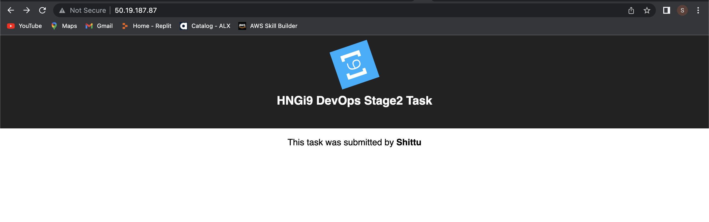
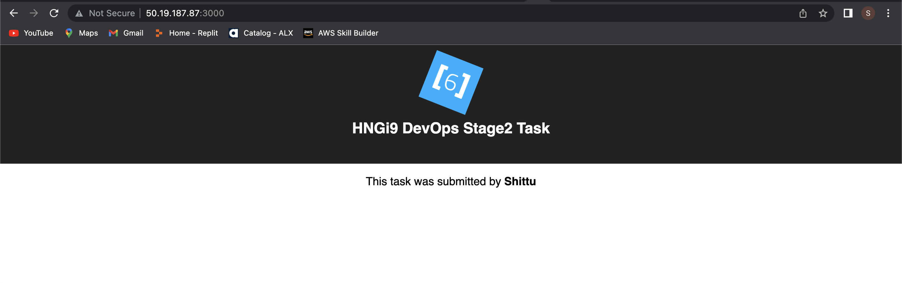

# devops-django-react-task

## Backend development workflow

```json
virtualenv env
source env/bin/activate
pip install -r requirements.txt
python manage.py runserver
```

## Frontend development workflow

You are to update your name in ./frontend/components/App.js

```json
npm i
npm start
```

## For deploying

```json
npm run build
```

##  Reverse Proxy using nginx to serve the frontend 
  + nginx.conf [link](./nginx/nginx.conf)

        upstream docker-frontend {
            server 127.0.0.1:3000;
        }

        server {
            listen 80;

            server_name localhost;

            location / {
                proxy_pass http://docker-frontend;

            }
        }

  + copy the configuration to nginx docker file [link](./nginx/Dockerfile)

        FROM nginx:stable-alpine

        COPY /nginx.conf /etc/nginx/conf.d/default.conf
  
  + Then we created a Dockerfile for both the api/backend [section](./api/Dockerfile) and the frontend application [section](./frontend/Dockerfile) to be able to run individually on separate container each
  + After which we introduced the docker-compose.yml [file](./docker-compose.yml) to spin up each docker file from [api/backend](./api/), [frontend](./frontend/) and [nginx](./nginx/) and to link them aal up together to communicate with each other by running:

        docker-compose up -d
  
  + We then deployed our project to Amazon Web Service (AWS) for others to access
  + Spin up the AWS EC2 service on the console and then have a root privilege to the ec2 console
  + Install on the dependecies of docker on ec2 to run our container

        sudo apt-get update
      <br/>

        sudo apt-get install \
        apt-transport-https \
        ca-certificates \
        curl \
        gnupg-agent \
        software-properties-common
      <br/>

        curl -fsSL https://download.docker.com/linux/ubuntu/gpg | sudo apt-key add -
      <br/>

        sudo apt-get install docker-ce docker-ce-cli containerd.io
      <br/>

        apt-cache madison docker-ce
      <br/>

        sudo apt-get install docker-ce docker-ce-cli containerd.io
      <br/>

        sudo apt install docker.io
      <br>

        sudo apt install docker-compose
      
  + Clone the the source code on the EC2 and chage the directory to the just cloned application after which you run:

        docker-compose up -d
  + Now we can access our application with the EC2 public address or <ip-address>:3000 since we exposed the app on port *80* through nginx and *3000* through the the react application
  
  

